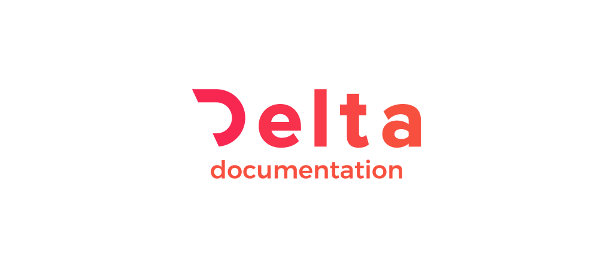

    

    The documentation for project Delta.

    

      
      
      
    

* Infers parameters, types, membership and more within the website's forum.
* Integrates with GitHub to link directly from documentation to the source it refers to.
* Customizable output on website: HTML, Markdown.
* International support on different languages: English, Russian.

## Contributing

If you have anything to fix or details to add, firstly, create an Issue, then create a pull request with your change.

This isn't intended to be an open-source wiki. Project wants to keep it concise and minimal but will accept fixes/suitable additions.

## License

Unless otherwise specified, everything in this repository is covered by the following licence: [CC-BY-4.0](https://spdx.org/licenses/CC-BY-4.0.html).