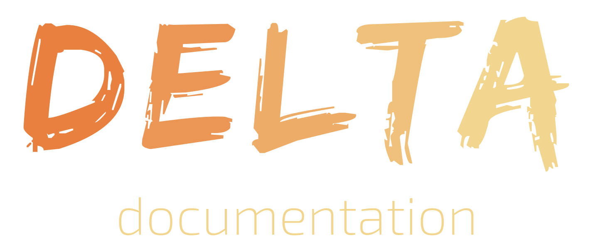

  

  The documentation for project Delta.

 
 

 

- Infers parameters, types, membership and more within the website's forum.
- Integrates with GitHub to link directly from documentation to the source it refers to.
- Customizable output on website: HTML, Markdown.

## Contributing

If you have anything to fix or details to add, firstly, create an Issue on GitHub to see if it's likely to be accepted, then file a pull request with your change (one PR per issue).

This isn't intended to be an open-source wiki. Project wants to keep it concise and minimal but will accept fixes/suitable additions.

## License

Unless otherwise specified, everything in this repository is covered by the following licence: [CC-BY-4.0](https://spdx.org/licenses/CC-BY-4.0.html).